# CognOS — Reasoning Layer for Agentic AI


[](https://doi.org/10.5281/zenodo.18731535)
[](https://orcid.org/0009-0000-4015-2357)

> **The Reasoning Layer for agentic AI**
> Know when to act, when to escalate, when to ask

---

## 🎯 What is CognOS?

Every AI stack has a Frontend, a Retrieval Layer, a Prompt Engineering layer, and an LLM. None of them answer the question that matters most for autonomous agents:

> *Should I act on this — or stop and ask?*

CognOS is the **Reasoning Layer** that sits between LLM output and agent action. Instead of binary auto/escalate decisions, it provides four nuanced decision types by combining epistemic and aleatoric uncertainty into a single confidence score:

| Decision | Condition | Action |
| -------- | --------- | ------ |
| **auto** | High confidence | Act autonomously |
| **synthesize** | Conflicting but coherent perspectives | Combine them |
| **explore** | Noise — low signal | Gather more information |
| **escalate** | High risk regardless of confidence | Defer to human |

---

## 🧮 Core Formula

```
C = p × (1 - Ue - Ua)

where:
  p   = majority vote proportion across N samples [0, 1]
  Ue  = epistemic uncertainty (variance of MC sample confidences)
  Ua  = aleatoric risk (ambiguity + irreversibility + blast_radius) / 3
  C   = composite confidence score [0, 1]
```

---

## 🏗️ Architecture — Six-Stage Reasoning Pipeline

```mermaid
graph LR
    S1[🔍 Stage 1<br/>Frame Validation<br/>Is the question well-posed?] --> S2
    S2[🎲 Stage 2<br/>Monte Carlo Sampling<br/>N=5 structured queries] --> S3
    S3[📊 Stage 3<br/>Confidence Decomposition<br/>C = p × 1 - Ue - Ua] --> S4
    S4{🚦 Stage 4<br/>Decision Gate} --> |auto| OUT[✅ Output]
    S4 --> |synthesize| S5
    S4 --> |explore| S2
    S4 --> |escalate| HUM[👤 Human]
    S5[🔄 Stage 5<br/>Recursive Synthesis<br/>Reason about disagreement] --> S6
    S6[📉 Stage 6<br/>Convergence Check<br/>ΔC < 0.05?] --> |converged| OUT
    S6 --> |not converged| S5

    style S1 fill:#e3f2fd,stroke:#1976d2,stroke-width:2px
    style S4 fill:#fff3e0,stroke:#f57c00,stroke-width:3px
    style S5 fill:#f3e5f5,stroke:#7b1fa2,stroke-width:2px
    style OUT fill:#e8f5e9,stroke:#388e3c,stroke-width:2px
    style HUM fill:#ffebee,stroke:#c62828,stroke-width:2px
```



**The critical dependency:** Stages 4–5 (metacognitive processing) are only reachable if `Ue > 0`. A model that returns identical high-confidence responses across all N samples produces `Ue ≈ 0` — collapsing all decisions to *auto* regardless of actual uncertainty. This is not a bug; it is the empirical finding that motivated the backing paper.

---

## ⚡ Installation

```bash
pip install cognos-ai
```

## 🚀 Quick Start

```python
from cognos import compute_confidence

result = compute_confidence(
    prediction=0.85,
    mc_predictions=[0.84, 0.86, 0.85, 0.87],
    ambiguity=0.1,
    irreversibility=0.2,
    blast_radius=0.05,
)

print(result['decision'])    # 'auto', 'synthesize', 'explore', or 'escalate'
print(result['confidence'])  # 0.803
print(result['Ue'])          # epistemic uncertainty signal
```

### Layer 2: Divergence Semantics

```python
from cognos import synthesize_reason, frame_transform

# Extract underlying assumptions from divergent votes
divergence = synthesize_reason(
    question="Should AI systems be regulated?",
    alternatives=["Strict control", "Light touch", "Innovation first"],
    vote_distribution={"A": 2, "B": 2},
    confidence=0.45,
    is_multimodal=True,
)

# Detect if a question is well-formed
frame = frame_transform(question="Color of Tuesday?")
```

### Layer 3: Convergence Control

```python
from cognos import convergence_check

result = convergence_check(
    iteration=3,
    confidence_history=[0.45, 0.50, 0.51],
    assumption_history=["Assumption A", "Assumption A"],
    threshold=0.05,
)
```

---

## 📄 Backing Research

CognOS was developed as an experimental probe for the following paper:

**[When Alignment Reduces Uncertainty: Epistemic Variance Collapse and Its Implications for Metacognitive AI](https://doi.org/10.5281/zenodo.18731535)**
[](https://doi.org/10.5281/zenodo.18731535)
Björn Wikström — 2026

> Alignment-optimized frontier models exhibit near-zero epistemic variance across repeated sampling, eliminating the uncertainty signal that metacognitive architectures require to function. Smaller, less-aligned models preserve this signal and enable divergence detection, assumption synthesis, and meta-level reasoning that frontier models cannot support. We propose that *epistemic noise* is not a defect to be engineered away, but a necessary prerequisite for metacognitive AI.

**Key findings:**

- Frontier LLMs (GPT-4o, Claude) produce `Ue ≈ 0` — making CognOS Stages 4–5 unreachable
- Medium-scale aligned models (Mistral-7B, Llama-3-8B) exhibit *calibrated* variance — epistemically useful
- Three epistemic variance profiles: *suppressed*, *undirected*, *calibrated* — only calibrated is useful
- The incompatibility between frontier LLMs and external metacognitive architectures may not be resolvable by scaling

---

## 📁 Project Structure

```
cognos-standalone/
├── cognos/                         # Main package
│   ├── __init__.py                 # Exports: compute_confidence, synthesize_reason, ...
│   ├── confidence.py               # Layer 1: Confidence engine
│   ├── divergence_semantics.py     # Layer 2–3: Divergence + convergence
│   └── core/
│       ├── cognos_deep.py          # Five-layer recursive analysis
│       └── cognos_integration_demo.py
├── research/                       # Theoretical foundation
│   ├── HYPOTHESIS.md               # Operational definitions & falsification criteria
│   └── INSIGHTS.md                 # Empirical findings
├── experiments/                    # Empirical validation
│   ├── eval_hypothesis.py
│   └── test_cognos_*.py
├── figures/                        # Results & visualizations
├── tests/
├── examples/
├── docs/
└── setup.py
```

---

## 🔬 Experiments

Run the evaluation suite:

```bash
python experiments/eval_hypothesis.py
python experiments/test_cognos_comprehensive.py
```

Generate figures:

```bash
python experiments/analyze_pareto.py
python experiments/analyze_ue_distribution.py
```

---

## 📚 Citation

**Cite the paper** (primary reference):

```bibtex
@article{wikstrom2026alignment,
  title={When Alignment Reduces Uncertainty: Epistemic Variance Collapse
         and Its Implications for Metacognitive AI},
  author={Wikström, Björn},
  year={2026},
  doi={10.5281/zenodo.18731535},
  url={https://doi.org/10.5281/zenodo.18731535},
}
```

**Cite the software:**

```bibtex
@software{wikstrom2026cognos,
  title={CognOS: Reasoning Layer for Agentic AI},
  author={Wikström, Björn},
  year={2026},
  url={https://github.com/Applied-Ai-Philosophy/cognos},
}
```

---

## 🤝 Contributing

Contributions welcome. File issues and PRs at [Applied-Ai-Philosophy/cognos](https://github.com/Applied-Ai-Philosophy/cognos).

This project is part of the [Applied AI Philosophy](https://github.com/Applied-Ai-Philosophy) research ecosystem.

---

## ⚖️ License

MIT License — see [LICENSE](LICENSE) file
